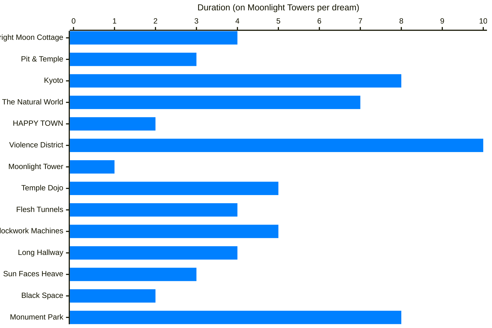

# Dream Timer and Duration
The dream timer keeps track of how long the Player has been on a dream. It begins as soon as you start hearing the music for the initial spawn, 
and continues ticking until the end of that day's dream. 

| Variable     |Adress on PSX memory|
|---           |:---:               |
| Dream Timer  |0x80091554          |
|Dream Duration|0x80091664          |

Once the Dream Timer value is **equal** to the value of Dream Duration, the game will begin the fadeout to end the dream. 
Or, in the case of a Flashback session, you will be teleported to the next flashback.

Since the timer is frame based (and does not stop during loading times), it has the odd quality of speeding up or slowing down 
depending on where you are and what you do, resulting on some element of randomness to the percieved length of the dream.

## The Dream Duration / Time Limit
For "standard" dreams, the time limit gets decided at the beginning of the dream, based on the location the player will first spawn on. 

(The location, of course, [is decided by the mood rating of the last day's dream](https://compu-lsd.com/w/Graph#Connection_to_starting_Field).) 

| Table                       |Adress on PSX memory|Offset on SLPS_015 file|
|---                          |:---:               |:---:                  |
| Dream Duration per Location |0x80087f14          |0x78714                |

| Location          | Time Limit on ROM | Time Limit in Frames | Duration@12fps | **Duration@15fps** | Duration@20fps |
|:---               |---:|---:|---:|---: |---:|
|Bright Moon Cottage|240|3600|05:00|**04:00**|03:00|
|Pit & Temple       |180|2700|03:45|**03:00**|02:15|
|Kyoto              |480|7200|10:00|**08:00**|06:00|
|The Natural World  |420|6300|08:45|**07:00**|05:15|
|HAPPY TOWN         |120|1800|02:30|**02:00**|01:30|
|Violence District  |600|9000|12:30|**10:00**|07:30|
|Moonlight Tower    | 60| 900|01:15|**01:00**|00:45|
|Temple Dojo        |300|4500|06:15|**05:00**|03:45|
|Flesh Tunnels      |240|3600|05:00|**04:00**|03:00|
|Clockwork Machines |300|4500|06:15|**05:00**|03:45|
|Long Hallway       |240|3600|05:00|**04:00**|03:00|
|Sun Faces Heave    |180|2700|03:45|**03:00**|02:15|
|Black Space        |120|1800|02:30|**02:00**|01:30|
|Monument Park      |480|7200|10:00|**08:00**|06:00|

## Time Limit "Parrying"
The Dream Timer does not stop while the player is linking to another location. 
Which means that, for standard dreams, linking actually *reduces* the percieved duration of the dream.
But, it is also possible for the dream timer to "overshoot" the time it is supposed to end.

In the event that the Player is in the middle of a link when the Dream End rolls around,
the game will actually roll back the dream timer, all the way back to zero, without ending the dream. 
This causes the dream to get extended for the same amount of minutes than the original dream length.

Since it takes a long time for the game to finish a link to another place, the timing for this trick is actually quite lenient. 
But the frame-based nature of the timer might make timing it properly a bit trickier.

## The Timer during Flashbacks
The timer works a bit differently during flashback sessions. First of all, each flashback on a session has a length of 300 frames (About 20 seconds, or one third of a Moonlight Tower). 
After this time is over, the timer will reset to zero, and the game will start loading the next flashback.

The timer will also reset to zero **any** time you use a link, meaning you can extend a flashblack indefinitely. As long you keep linking
within the time limit.

## Force Quitting Entities
On top of the "regular" timer behaviour described above, the game also allows certain Entities to forcibly cut a dream short by directly setting the dream timer to the time limit.
The more obvious examples of this are the Lions in the Natural World and the Ferris Wheel in HAPPY TOWN.
But other instances like the Old Ladies in Kyoto will also cause the dream timer to be cut short after a short while of interacting with them.

## Corrupted Textures and the Dream Duration
Corruption is hard to replicate at the moment, so this section is not very well researched, but I once managed to get a look at the timer
while the textures were corrupted. In these types of dreams, The time limit would start at a relatively small value. But every time you linked,
the **time limit** value itself would increase a little. This behaviour is unlike the ones from the normal dreams or the flashbacks, which makes me
wonder if perhaps a function is being called at the wrong time, or with the wrong parameters. 